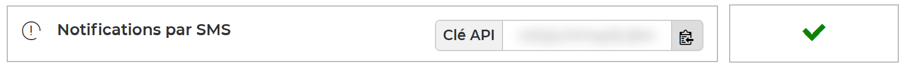

# Free Mobile for PHP
Send SMS messages to your [Free Mobile](https://mobile.free.fr) device via any internet-connected device.

For example, you can configure a control panel or storage connected to your home network to send a notification to your mobile phone when an event occurs.

## Quick start
> SMS notifications require an API key. If you are not already registered, [sign up for a Free Mobile account](https://mobile.free.fr/subscribe).

### Get an API key
You first need to enable the **SMS notifications** in [your subscriber account](https://mobile.free.fr/account).
This will give you an identification key allowing access to the [Free Mobile](https://mobile.free.fr) API.



### Get the library
Install the latest version of **Free Mobile for PHP** with [Composer](https://getcomposer.org) package manager:

```shell
composer require cedx/free-mobile
```

For detailed instructions, see the [installation guide](installation.md).

## Usage
This library provides the `Client` class, which allow to send SMS messages to your mobile phone by using the `sendMessage()` method:

```php
use freemobile\Client;
use Psr\Http\Client\ClientExceptionInterface;

try {
  $client = new Client(account: "your account identifier", apiKey: "your API key");
  $client->sendMessage("Hello World from PHP!");
  print "The message was sent successfully.";
}
catch (ClientExceptionInterface $e) {
  print "An error occurred: {$e->getMessage()}";
}
```

The `Client->sendMessage()` method throws a `Psr\Http\Client\ClientExceptionInterface` if any error occurred while sending the message.

> The text of the messages will be automatically truncated to **160** characters: you can't send multipart messages using this library.

## See also
- [API reference](api/)
- [Packagist package](https://packagist.org/packages/cedx/free-mobile)
- [Code coverage](https://app.codecov.io/gh/cedx/free-mobile.php)
